# 🐙 Github

A GitHub mobile client built with **Kotlin Multiplatform (KMP)** and **Compose Multiplatform**, targeting Android and iOS.


## ✨ Features

- **Home** — My Work (top repos, organizations), Favorites, Shortcuts, and Recent activity feed
- **Profile** — User info, popular repos, repositories, organizations, starred, and projects
- **Repositories** — Browse and filter repos by type, language, and sort order
- **Repository Detail** — Issues, Pull Requests, Discussions, Actions, Releases, Contributors, Watchers, Code, and Commits
- **Pull Requests** — List with filters (Open, Draft, Label, Author, Assignee); create PRs with branch comparison
- **Inbox** — Notification feed with Focused/Unread filters and per-repository scoping; swipe actions (mark done / unsubscribe)
- **Explore** — Trending Repositories, Awesome Lists, and activity feed
- **Settings** — Theme, language, notification options (push types, working hours, live agent updates), code options (line numbers, dark theme, font size, wrap lines), accounts, app lock, Copilot subscription

## 🖼️ Screenshots

| Home | Profile | Repositories |
|------|---------|--------------|
| 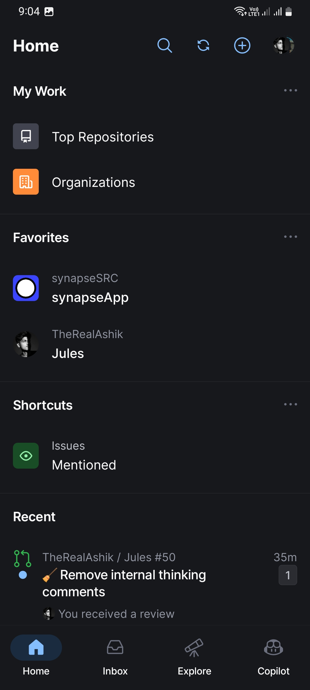 | 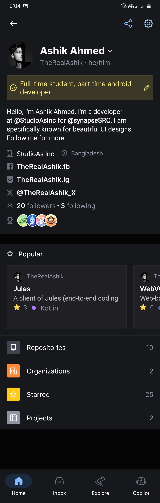 | 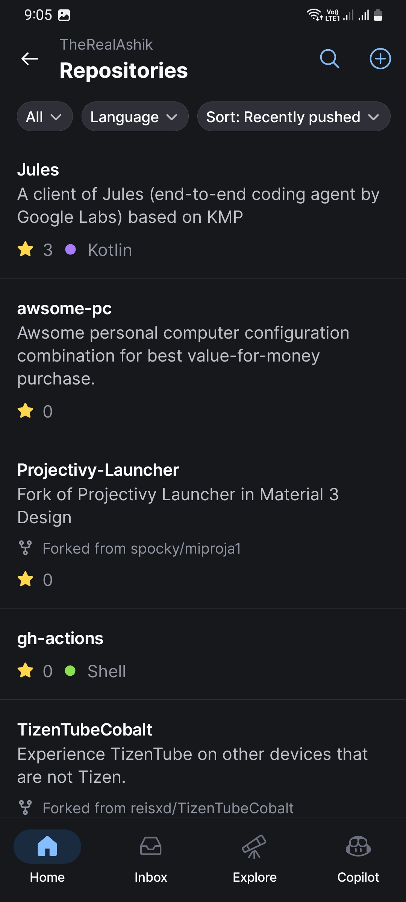 |

| Repository | Inbox | Explore |
|------------|-------|---------|
| 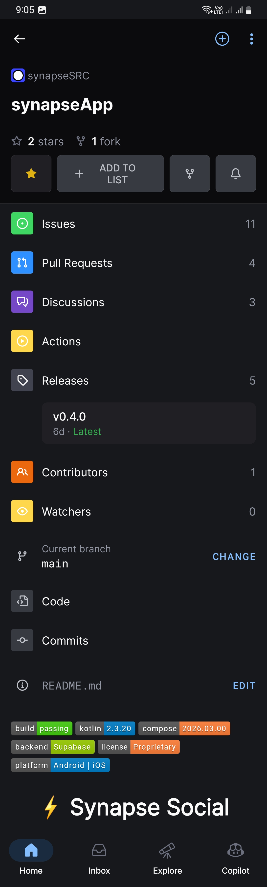 | 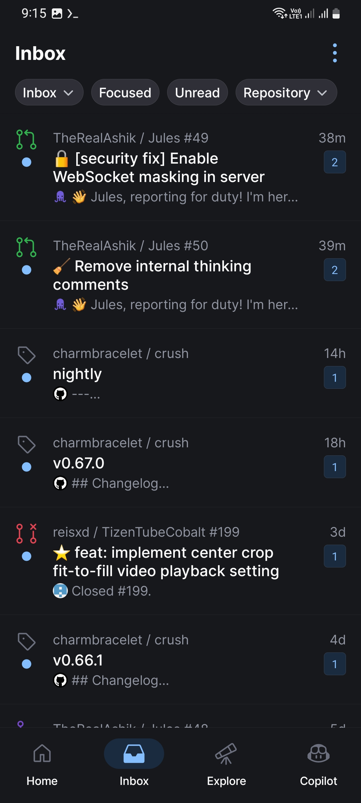 | 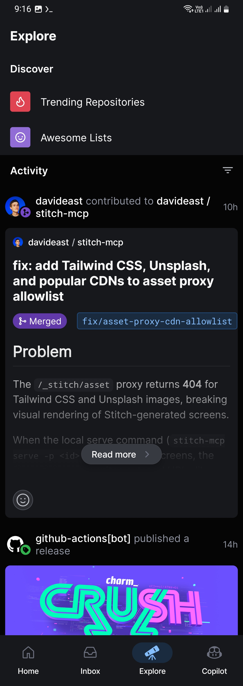 |

| Pull Requests | Compare Branches | Accounts |
|---------------|-----------------|---------|
| 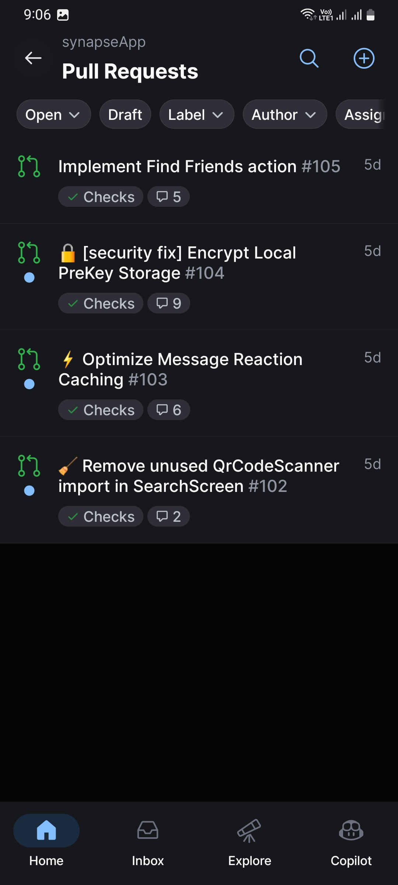 | 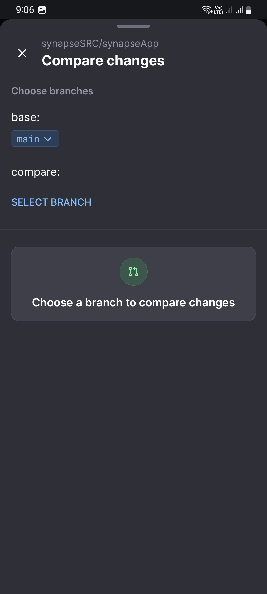 | 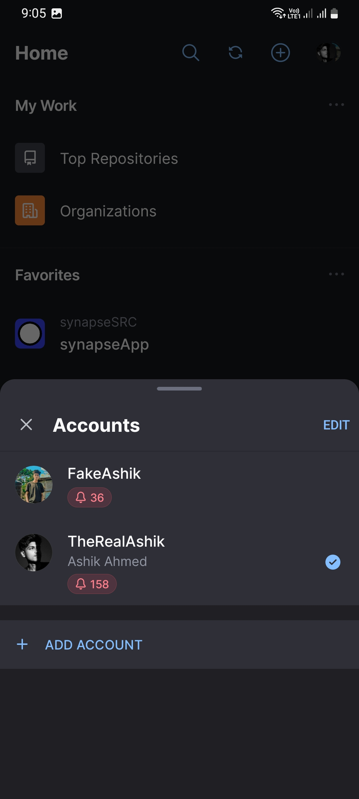 |

| Settings | Notifications | Code Options |
|----------|--------------|--------------|
| 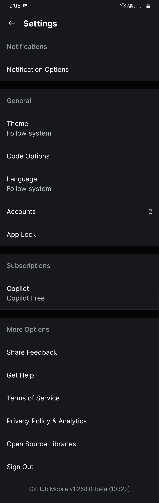 | 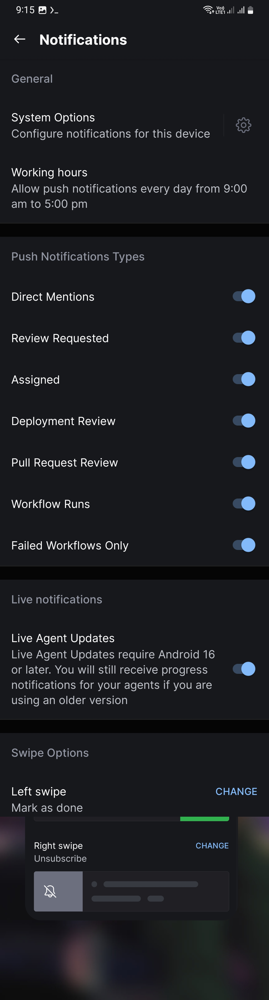 | 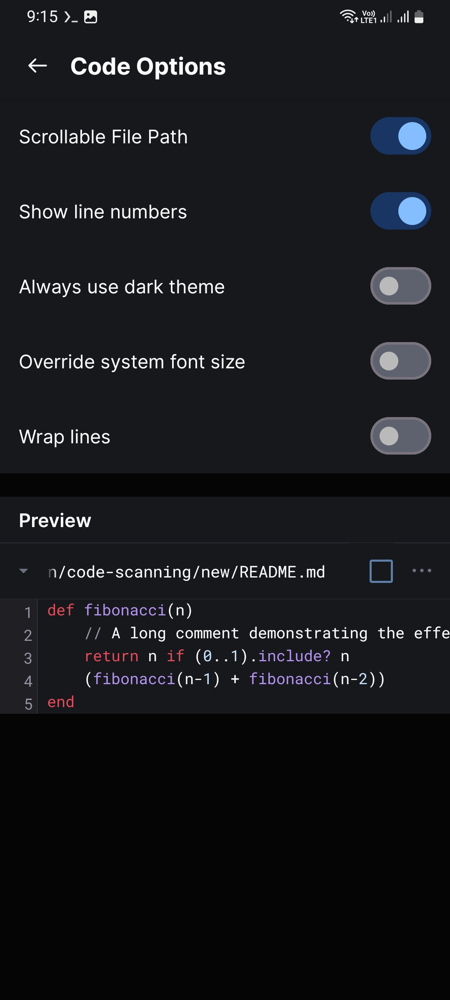 |

## 🛠️ Tech Stack

| Layer | Technology |
|-------|-----------|
| Language | Kotlin 2.3.21 |
| UI | Compose Multiplatform 1.10.3 |
| Architecture | KMP (Android + iOS) |
| Build | Gradle with Version Catalogs |
| Min SDK | Android 24 |

## 🚀 Getting Started

### Prerequisites
- Android Studio Meerkat or later
- Xcode 15+ (for iOS)
- JDK 11+

### Clone & Run

```bash
git clone https://github.com/TheRealAshik/Github.git
cd Github
```

**Android:**
```bash
./gradlew :composeApp:assembleDebug
```

**iOS:** Open `iosApp/iosApp.xcodeproj` in Xcode and run.

## 📁 Project Structure

```
Github/
├── composeApp/          # Shared KMP + Compose UI code
│   └── src/
│       ├── commonMain/  # Shared business logic & UI
│       ├── androidMain/ # Android-specific code
│       └── iosMain/     # iOS-specific code
├── iosApp/              # iOS app entry point
└── gradle/              # Gradle version catalog
```

## 👤 Author

**Ashik Ahmed** ([@TheRealAshik](https://github.com/TheRealAshik))
